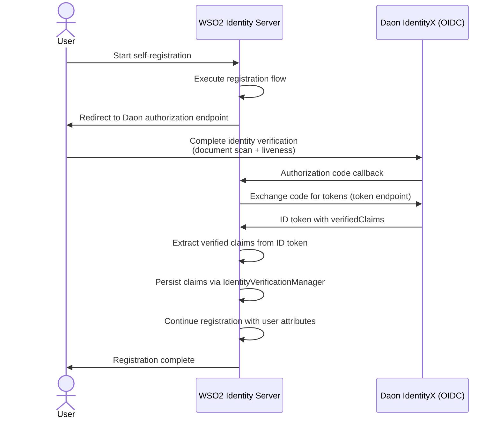
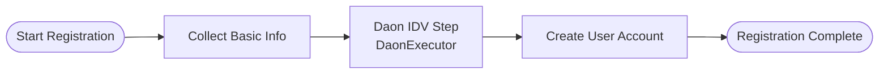

# WSO2 Identity Server — Daon Identity Verification Connector

This connector integrates [Daon IdentityX](https://www.daon.com/) as an identity verification (IDV) provider into WSO2 Identity Server (IS) self-registration flows. It implements both a classic `ApplicationAuthenticator` and a flow-engine `Executor`, allowing the Daon IDV step to be embedded in a user registration journey.

---

## How It Works

Daon acts as an OIDC authorization server. During self-registration, the user is redirected to Daon to complete identity verification (e.g. document scan + liveness check). On success, Daon returns an ID token containing verified claims such as name, birthdate, and document details inside a `verifiedClaims` structure. The connector extracts these claims, persists them via WSO2's Identity Verification API, and continues the registration flow.

### Flow Diagram



### ID Token Structure

The Daon ID token carries verified claims in the following structure:

```json
{
  "sub": "<daon-user-uuid>",
  "verifiedClaims": {
    "claims": {
      "family_name_and_given_name": "PELANDA HEWAGE SADIL CHAMISHKA",
      "birthdate": "1996-11-22",
      "document_number": "B4427581",
      "document_classification": "Driving License",
      "document_date_of_expiry": "2026-08-09",
      "document_type": "driving_license",
      "address": { "formatted": "SAMEERA UDAGEDARA^KAMBURUGAMUWA" }
    },
    "verification": {
      "trust_framework": "daon-identify-1"
    }
  }
}
```

---

## Prerequisites

| Requirement | Version |
|---|---|
| WSO2 Identity Server | 7.x (flow execution engine support required) |
| Java | 11+ |
| Maven | 3.6+ |
| Daon IdentityX tenant | Active with OIDC client configured |

---

## Building

```bash
mvn clean install -Dmaven.test.skip=true
```

The connector JAR is produced at:

```
component/target/org.wso2.carbon.extension.identity.authenticator.daon.connector-<version>.jar
```

---

## Deploying

Copy the connector JAR to the WSO2 IS `dropins` directory:

```bash
cp component/target/org.wso2.carbon.extension.identity.authenticator.daon.connector-*.jar \
   <IS_HOME>/repository/components/dropins/
```

Restart WSO2 IS.

---

## WSO2 IS Setup

### 1 — Create the Daon Connection

1. Log in to the WSO2 IS Console (`https://<host>:9443/console`).
2. Navigate to **Connections** → **New Connection**.
3. Select **Expert Mode** (or **Custom Connector**).
4. Under **General**, set:
   - **Name**: `Daon`
   - **Description**: Daon IdentityX identity verification
5. Under **Settings**, pick **`DaonAuthenticator`** as the authenticator.
6. Configure the following properties:

| Property | Description | Example |
|---|---|---|
| `daonAuthorizationEndpoint` | Daon OIDC authorization URL | `https://<tenant>.trustx.com/auth/realms/<realm>/protocol/openid-connect/auth` |
| `daonTokenEndpoint` | Daon OIDC token URL | `https://<tenant>.trustx.com/auth/realms/<realm>/protocol/openid-connect/token` |
| `ClientId` | OIDC client ID issued by Daon | `WSO2IDP` |
| `ClientSecret` | OIDC client secret issued by Daon | `<secret>` |
| `callbackUrl` | Redirect URI registered with Daon | `https://<IS_HOST>:9443/commonauth` |

7. Save the connection.

### 2 — Register an Identity Verification Provider

This step makes the persisted IDV claims queryable via the IS API.

1. Navigate to **Identity Verification Providers** → **New Provider**.
2. Set the **Provider ID** to `DAON` (must match `DaonAuthenticatorConstants.DAON_IDV_PROVIDER_ID`).
3. Fill in the display name and save.

### 3 — Add Daon to a Registration Flow



1. Navigate to **Users** → **Self Registration** → **Registration Flows** (or the relevant flow editor).
2. Add a new step and select **`DaonExecutor`** as the executor.
3. Position it before the user account creation step so that the verified subject (`sub`) is available.
4. Save and publish the flow.

> **Note on user ID timing**: The IDV claims are persisted immediately after the Daon callback. If the user account has not been created yet at that point in the flow (i.e. `FlowUser.getUserId()` is null), persistence is skipped with a warning. Place the Daon step **after** account creation, or implement a post-creation hook, to ensure claims are always stored.

---

## Claim Dialect

All IDV claims extracted from the Daon ID token are mapped under the dialect:

```
http://wso2.org/daon/claims/<claim-key>
```

For example, `birthdate` becomes `http://wso2.org/daon/claims/birthdate`.

The `address.formatted` field is flattened to a plain string value.

---

## Configuration Reference

| Constant | Value | Purpose |
|---|---|---|
| `DAON_IDV_PROVIDER_ID` | `DAON` | IDV provider ID registered in IS |
| `CLAIM_DIALECT_URI` | `http://wso2.org/daon/claims` | Base URI for extracted claims |
| `DAON_OAUTH_ENDPOINT` | *(see constants)* | Default authorization endpoint |
| `DAON_TOKEN_ENDPOINT` | *(see constants)* | Default token endpoint |

---

## License

Licensed under the [Apache License 2.0](LICENSE).
