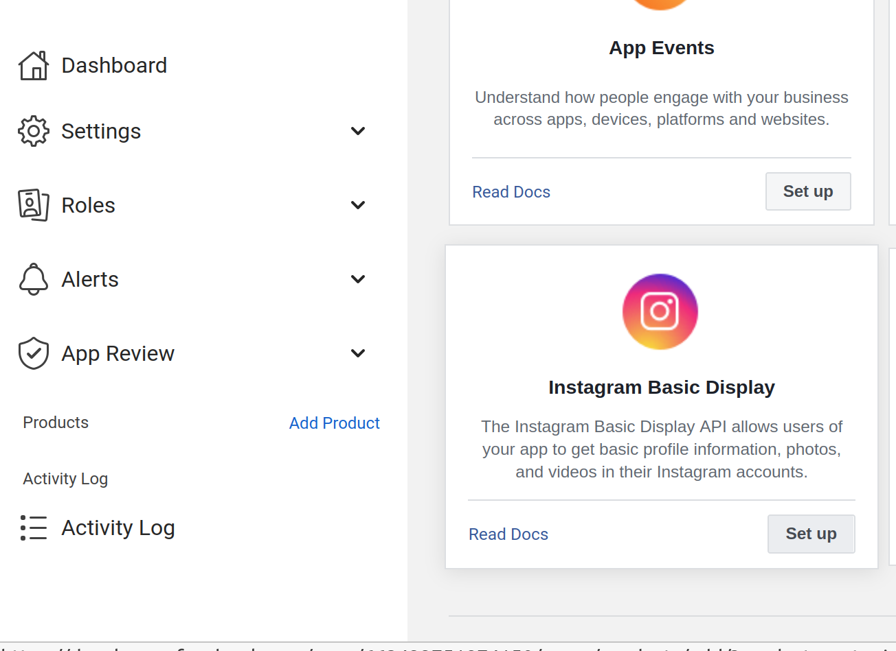
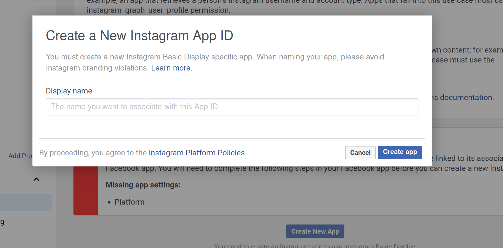
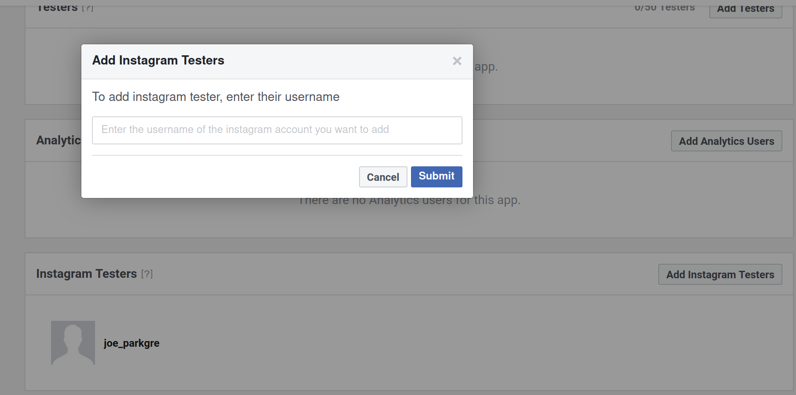
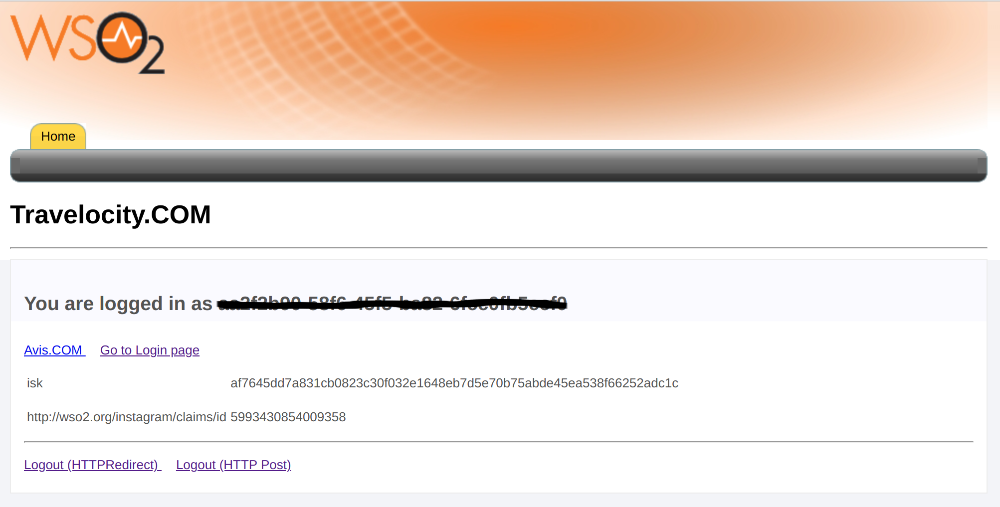

# Instagram Authenticator

The Instagram authenticator is configured as a federated authenticator in WSO2 Identity Server to authenticate Instagram users to log in to your organization’s applications. Instagram is an online mobile photo-sharing, video-sharing, and social networking service. This enables its users to take pictures and videos, and share them on a variety of social networking platforms.

The diagram below illustrates the flow of the Instagram federated authenticator.


This page provides instructions on how to configure the Instagram authenticator and Identity Server using a sample app. You can find more information in the following sections.

```
This is tested with the Instagram API version 1.0 (v1). Instagram authenticator is supported by Identity Server 5.1.0 upwards.
```

* [Deploying Instagram artifacts](#Deploying-Instagram-artifacts)
* [Configuring the Instagram App](#Configuring-the-Instagram-App)
* [Deploying travelocity.com sample app](#Deploying-travelocity.com-sample-app)
* [Configuring the identity provider](#Configuring-the-identity-provider)
* [Configuring the service provider](#Configuring-the-service-provider)
* [Configuring claims](#Configuring-claims)
* [Configuring requested claims for travelocity.com](#Configuring-requested-claims-for-travelocity.com)
* [Testing the sample](#Testing-the-sample)

## Deploying Instagram artifacts

* Either Download the artifacts for this authenticator from [the store](https://store.wso2.com/store/assets/isconnector/details/175db9b2-1aae-4402-adee-94c4acd751d2) or [build the project](Building From the Source) to get the jar and by adding it in the <IS-Home>/repository/components/dropins directory.

* If you want to upgrade the Instagram Authenticator (.jar) in your existing IS pack, follow the bellow instructions.
  * Stop WSO2 Identity Server if the server is already running.
  * Download and extract the latest version of the authenticator artifacts (.jar, .war, gadgets etc.,) from the connector store.
  * Replace the old .jar file(org.wso2.carbon.extension.identity.authenticator.instagram.connector-x.x.x.jar) found in the <IS_HOME>/repository/components/dropins folder with the new .jar file that you downloaded.
  
## Building From the Source

Follow the steps given below to build the Instagrqam authenticator from the source code:

1. Get a clone or download the source from [Github](https://github.com/wso2-extensions/identity-outbound-auth-instagram).
2. Run the following maven command from the `identity-outbound-auth-instagram` directory: `mvn clean install`.
3. org.wso2.carbon.extension.identity.authenticator.instagram.connector-x.x.x.jar file is created in the `identity-outbound-auth-instagram/component/target` directory.

## Configuring the Instagram App

1. Download the `Instagram` app for iOS from the App Store, Android from Google Play Store or Windows Phone from the Windows Phone Store. 

2. Once the app is installed, tap to open it. 

3. Sign up and create an account using your email ID.

4. Navigate to https://www.instagram.com/ and log in using the credentials that you used to create the account.

5. Go to https://developers.facebook.com and select My Apps from the top menu bar and Create Application. You can provide the status as Consumer or none.
 
6. Click ‘Add products’ under the Product, select Instagram Basic Display.

 
7. Select ‘Create New App’ and provide a name for the application.

 
8. In the resulting window, enter `https://localhost:9443/commonauth` as Valid OAuth Redirect URI, Deauthorize callback URL and Data Deletion Request URL and click save.

  Please save the Instagram App ID and Instagram App Secret for later use.
 
9. Select ‘Roles’ under App Roles and add an instagram test user by providing the user’s instagram username.
Users can accept the invitation from the [Apps and websites](https://www.instagram.com/accounts/manage_access) section in their account. 


## Deploying travelocity.com sample app

The next step is to deploy the travelocity.com sample app in order to use it in this scenario.
To configure this, see [deploying travelocity.com sample app](https://is.docs.wso2.com/en/5.9.0/learn/deploying-the-sample-app/#deploying-the-travelocity-webapp).
 
## Configuring the identity provider

Now you have to configure WSO2 Identity Server by [adding a new identity provider](https://docs.wso2.com/display/IS570/Adding+and+Configuring+an+Identity+Provider).

* Download the WSO2 Identity Server from [here](http://wso2.com/products/identity-server/).

* Run the [WSO2 Identity Server](https://docs.wso2.com/display/IS570/Running+the+Product).

* Log in to the [management console](https://docs.wso2.com/display/IS570/Getting+Started+with+the+Management+Console) as an administrator.

* In the `Identity Providers` section under the `Main` tab of the management console, click `Add`.

* Give a suitable name for `Identity Provider` Name and configure the authenticator. To do this, navigate to `Instagram Configuration` under `Federated Authenticators` and fill the form.
    
 
    Do the following configurations.
    
    |Field|Description|Sample value|
    |----|----|----|
    |Enable|Selecting this option enables Instagram to be used as an authenticator for users provisioned to the Identity Server.|Selected|
    |Default|Selecting the 'Default' checkbox signifies that Instagram is the main/default form of authentication. This removes the selection made for any other 'Default' checkboxes for other authenticators.|Selected|
    |Client Id|This is the `Instagram App ID` of the Instagram application.|aa6f12fd086e4b58a6707d5b61377a71|
    |Client Secret|This is the `Instagram App Secret` of the created Instagram application. Click the Show button to view the value you enter.|fffc3f4808f34e01b0bc529ce78f5980|
    |Callback URL|This is the URL to which the browser should be redirected after the authentication is successful. It should have this format: https://(host-name):(port)/acs.|https://localhost:9443/commonauth|
    
* Select both checkboxes to `Enable` the Instagram authenticator and make it the `Default`.

* Click Register.

You have now added the identity provider.

## Configuring the service provider

The next step is to configure the service provider.

1. Return to the management console.

2. In the `Service Providers` section, click `Add` under the `Main` tab.

3. Since you are using travelocity as the sample, enter travelocity.com in the `Service Provider Name` text box and click `Register` .

4. In the `Inbound Authentication Configuration` section, click `Configure` under the `SAML2 Web SSO Configuration` section.

5. Now set the configuration as follows:
    1. Issuer: travelocity.com
    2. Assertion Consumer URL: http://localhost:8080/travelocity.com/home.jsp
    
6. Select the following check-boxes:
    1. Enable Response Signing.
    2. Enable Single Logout. 
    3. Enable Attribute Profile.
    4. Include Attributes in the Response Always.

   
   
7. Click `Update` to save the changes. Now you will be sent back to the `Service Providers` page.

8. Navigate to the Local and `Outbound Authentication Configuration` section.
 
9. Select the identity provider you created from the drop-down list under `Federated Authentication`.


10. Ensure that the `Federated Authentication` radio button is selected and click  `Update` to save the changes. 

You have now added and configured the service provider.

```
Related Topics
For more information on service provider configuration, see https://docs.wso2.com/display/IS570/Configuring+Single+Sign-On.
```
 
## Testing the sample

1. To test the sample, go to the following URL: http://<TOMCAT_HOST>:<TOMCAT_PORT>/travelocity.com/index.jsp. E.g., http://localhost:8080/travelocity.com

2. Login with SAML from the WSO2 Identity Server.


    
    
3. Enter your Instagram credentials in the prompted login page of Instagram. Once you login successfully you will be taken to the home page of the travelocity.com app.
    
    
